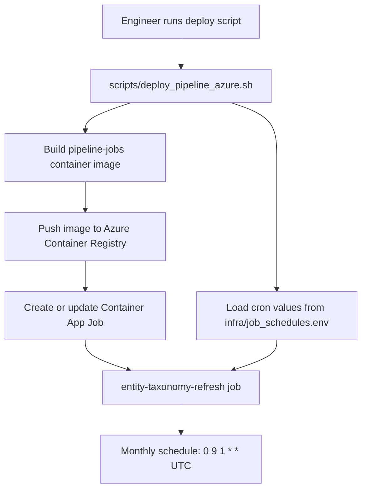
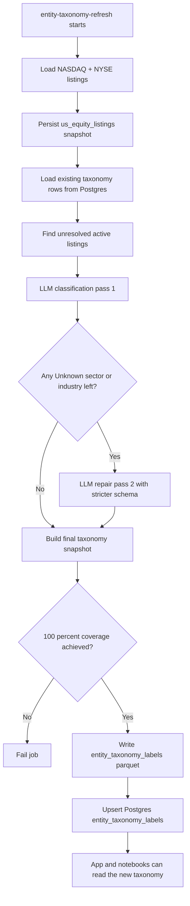
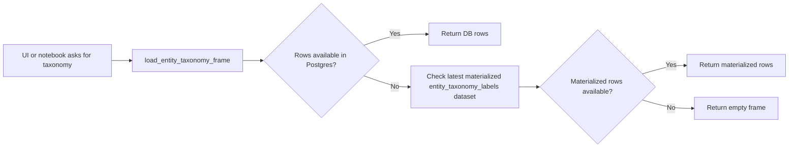
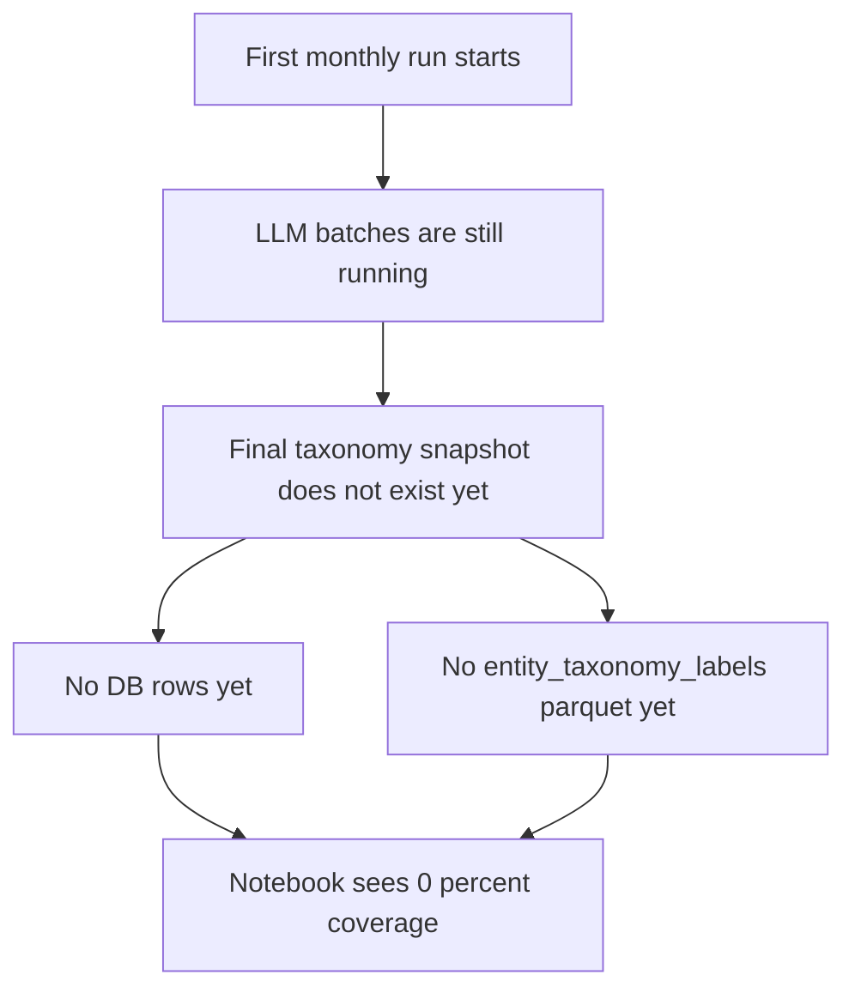

# Entity Taxonomy Pipeline Flow

This is the easiest way to understand the new taxonomy setup end to end.

## What this pipeline does

- Builds a fresh NASDAQ + NYSE listing universe.
- Classifies every active listing into `sector`, `industry`, and `peer_group`.
- Writes the finished snapshot to:
  - Blob / pipeline store as `entity_taxonomy_labels`
  - Postgres as `entity_taxonomy_labels`
- Powers the app's taxonomy lookups through a DB-first read path.

The pipeline is dynamic-only. It does not depend on the old curated override dictionaries to produce the monthly snapshot.

## 1) Setup and deployment flow

## 2) Monthly runtime flow

## 3) App read path

## 4) Why coverage can show 0 percent during bootstrap

This is expected during the first full bootstrap because the current job writes taxonomy only after the full snapshot is complete.

## 5) Source of truth by stage

| Stage | Source of truth |
| --- | --- |
| Job schedule | `infra/job_schedules.env` |
| Azure deployment wiring | `scripts/deploy_pipeline_azure.sh` |
| Job dispatch | `pipeline/jobs/main.py` |
| Taxonomy build logic | `services/entity_taxonomy.py` |
| Dataset-to-job mapping | `services/pipeline_store.py` |
| Runtime reads | `services/entity_taxonomy.py` via `load_entity_taxonomy_frame()` |

## 6) Key datasets and tables

- `us_equity_listings`
  - Fresh listing universe for NASDAQ and NYSE.
- `entity_taxonomy_labels`
  - Final labeled taxonomy snapshot for app and notebook reads.
- Postgres table: `entity_taxonomy_labels`
  - DB-backed read path used first by the app.

## 7) Operational checklist

When taxonomy looks wrong or empty, check these in order:

1. Is the Azure job `entity-taxonomy-refresh` deployed and scheduled?
2. Did the latest execution finish successfully?
3. Does `us_equity_listings` exist for the current run?
4. Does `entity_taxonomy_labels` exist in Blob?
5. Did Postgres receive rows in `entity_taxonomy_labels`?
6. Does `load_entity_taxonomy_frame()` return rows locally?

## 8) Important implementation note

Some legacy hardcoded taxonomy constants may still exist in old files as dead code, but the active monthly taxonomy pipeline and runtime read path are now centered on:

- `run_entity_taxonomy(...)` in `pipeline/jobs/main.py`
- `build_entity_taxonomy_snapshot(...)` in `services/entity_taxonomy.py`
- `load_entity_taxonomy_frame(...)` in `services/entity_taxonomy.py`
